<div align="center">

# 🐍 {{ cookiecutter.project_name }}

### Modern Python Project Template | Cookiecutter | Best Practices | Production-Ready

[](https://python.org)
[](https://github.com/astral-sh/ruff)
[](https://pre-commit.com/)
[](LICENSE)

**A production-ready Python project template featuring modern tooling, automated code quality checks, and industry best practices.**

[Quick Start](#-quick-start) •
[Features](#-features) •
[Architecture](#-architecture) •
[Documentation](#-documentation)

</div>

---

## 🎯 Why This Template?

| Metric | Impact |
|--------|--------|
| **10x Faster Linting** | Ruff replaces Black, isort, Flake8 in a single tool |
| **100% Type Coverage** | Full mypy strict mode integration |
| **Zero Config Setup** | One command to scaffold and start coding |
| **CI/CD Ready** | Pre-configured GitHub Actions workflows |
| **Security First** | Bandit security scanning built-in |

---

## 🏗️ Architecture Overview

### Development Workflow

```mermaid
flowchart LR
    subgraph DEV["🖥️ Development"]
        A["✏️ Write<br/>Code"] --> B["💾 Save<br/>File"]
    end

    subgraph VCS["📦 Version Control"]
        B --> C["📝 Stage<br/>Changes"]
        C --> D["✅ Commit"]
        D --> E["🚀 Push<br/>to Remote"]
    end

    subgraph GATES["🛡️ Automated Quality Gates"]
        direction TB
        D -.-> G1["🔍 Ruff<br/>Lint + Format"]
        D -.-> G2["🔷 Mypy<br/>Type Check"]
        D -.-> G3["🔒 Bandit<br/>Security Scan"]
        D -.-> G4["📋 Commitizen<br/>Conventional Commits"]
    end

    style DEV fill:#e1f5fe,stroke:#01579b
    style VCS fill:#f3e5f5,stroke:#4a148c
    style GATES fill:#fff3e0,stroke:#e65100
```



### Project Structure

```mermaid
flowchart TB
    subgraph ROOT["📁 project_name/"]
        direction TB
        subgraph SRC["📂 src/"]
            subgraph PKG["📂 project_name/"]
                INIT["📄 __init__.py<br/><small>Package init</small>"]
                MAIN["📄 main.py<br/><small>Core logic</small>"]
                CLI["📄 my_cli.py<br/><small>Typer CLI</small>"]
                RICH["📄 rich_demo.py<br/><small>Rich UI demos</small>"]
            end
        end
        subgraph TESTS["📂 tests/"]
            TEST["📄 test_main.py<br/><small>Pytest suite</small>"]
        end
        PYPROJ["📄 pyproject.toml<br/><small>Unified config</small>"]
        PRECOMMIT["📄 .pre-commit-config.yaml<br/><small>Git hooks</small>"]
        README["📄 README.md<br/><small>Documentation</small>"]
        GITIGNORE["📄 .gitignore"]
    end

    style ROOT fill:#e8f5e9,stroke:#2e7d32
    style SRC fill:#e3f2fd,stroke:#1565c0
    style PKG fill:#fff8e1,stroke:#f9a825
    style TESTS fill:#fce4ec,stroke:#c2185b
```



---

## ✨ Features

<table>
<tr>
<td width="50%">

### 🔧 Development Tools
- **Ruff** - Lightning-fast linter & formatter
- **Mypy** - Static type checking
- **Pytest** - Testing with async & coverage
- **Pre-commit** - Automated git hooks

</td>
<td width="50%">

### 🛡️ Quality & Security
- **Bandit** - Security vulnerability scanning
- **Commitizen** - Conventional commits
- **pip-tools** - Dependency management
- **GitHub Actions** - CI/CD pipelines

</td>
</tr>
</table>

---

## 🚀 Quick Start

### Prerequisites
- Python {{ cookiecutter.python_version }}+
- [Cookiecutter](https://cookiecutter.readthedocs.io/) (`pip install cookiecutter`)

### Generate Your Project

```bash
# Generate from template
cookiecutter gh:asq-sheriff/cookiecutter-modern-python

# Navigate to your new project
cd your-project-name

# Create and activate virtual environment
python3 -m venv .venv
source .venv/bin/activate  # macOS/Linux
# .venv\Scripts\activate   # Windows

# Install development dependencies
pip install -e ".[dev]"

# Initialize git and pre-commit hooks
git init
pre-commit install --install-hooks
```

---

## 📦 Tool Stack


---

## 📋 Configuration

### pyproject.toml (Unified Configuration)

```toml
[build-system]
requires = ["setuptools>=61.0", "wheel"]
build-backend = "setuptools.build_meta"

[project]
name = "{{ cookiecutter.project_slug }}"
version = "0.1.0"
description = "{{ cookiecutter.description }}"
authors = [{ name = "{{ cookiecutter.author_name }}", email = "{{ cookiecutter.author_email }}" }]
readme = "README.md"
requires-python = ">= {{ cookiecutter.python_version }}"

[project.optional-dependencies]
dev = [
    "pre-commit>=4.4.0",
    "ruff>=0.11.9",
    "mypy>=1.15.0",
    "bandit>=1.8.3",
    "docformatter>=1.7.7",
    "commitizen>=4.7.0",
    "pytest>=8.0.0",
    "pytest-cov>=4.1.0",
    "pytest-asyncio>=0.23.0",
]
```

---

## 🔄 Development Workflow

```mermaid
flowchart TD
    A["📝 <b>git add .</b><br/><small>Stage changes</small>"] --> B["💬 <b>git commit -m 'feat: ...'</b><br/><small>Create commit</small>"]

    B --> HOOKS

    subgraph HOOKS["🔗 PRE-COMMIT HOOKS"]
        direction TB
        H1["1️⃣ <b>ruff check --fix</b><br/><small>Auto-fix lint issues</small>"]
        H2["2️⃣ <b>ruff format</b><br/><small>Format code</small>"]
        H3["3️⃣ <b>mypy</b><br/><small>Type check</small>"]
        H4["4️⃣ <b>bandit</b><br/><small>Security scan</small>"]
        H5["5️⃣ <b>commitizen</b><br/><small>Validate message</small>"]
        H1 --> H2 --> H3 --> H4 --> H5
    end

    HOOKS --> CHECK{All Checks<br/>Pass?}

    CHECK -->|"✅ Yes"| SUCCESS["🎉 <b>Commit Succeeds</b><br/><small>Changes recorded</small>"]
    CHECK -->|"❌ No"| FAIL["🔧 <b>Commit Blocked</b><br/><small>Fix issues & retry</small>"]
    FAIL --> A

    style A fill:#e3f2fd,stroke:#1565c0
    style B fill:#e3f2fd,stroke:#1565c0
    style HOOKS fill:#fff3e0,stroke:#e65100
    style CHECK fill:#f3e5f5,stroke:#7b1fa2
    style SUCCESS fill:#e8f5e9,stroke:#2e7d32
    style FAIL fill:#ffebee,stroke:#c62828
```



### Commands Reference

| Command | Description |
|---------|-------------|
| `ruff check .` | Run linter on all files |
| `ruff check --fix .` | Auto-fix linting issues |
| `ruff format .` | Format all Python files |
| `mypy .` | Run type checking |
| `pytest --cov=src` | Run tests with coverage |
| `bandit -r src/` | Security vulnerability scan |
| `pre-commit run --all-files` | Run all hooks manually |

---

## ⚠️ Known Issues

### Typer/Click Compatibility

As of May 2025, Typer has a known incompatibility with Click 8.2.0+. Workaround:

```bash
pip install "click==8.1.8"
```

Track updates: [Typer GitHub Issue #1215](https://github.com/fastapi/typer/issues/1215)

---

## 📁 Generated Project Structure

```
{{ cookiecutter.project_slug }}/
├── src/
│   └── {{ cookiecutter.project_slug }}/
│       ├── __init__.py
│       ├── main.py          # Core functionality
│       ├── my_cli.py        # CLI with Typer
│       └── rich_demo.py     # Rich terminal demos
├── tests/
│   └── test_main.py
├── .pre-commit-config.yaml
├── pyproject.toml
├── .gitignore
└── README.md
```

---

## 🤝 Contributing

1. Fork the repository
2. Create a feature branch (`git checkout -b feat/amazing-feature`)
3. Commit changes (`git commit -m 'feat: add amazing feature'`)
4. Push to branch (`git push origin feat/amazing-feature`)
5. Open a Pull Request

---

## 📄 License

Distributed under the MIT License. See `LICENSE` for more information.

### Attribution

If you use this template, please acknowledge the creator:

```
Created by Aejaz (https://github.com/asq-sheriff)
Template: cookiecutter-modern-python
```

Or include a badge in your README:

```markdown
[](https://github.com/asq-sheriff/cookiecutter-modern-python)
```

---

## 👤 Author

**Aejaz**
- GitHub: [@asq-sheriff](https://github.com/asq-sheriff)

---

<div align="center">

**Built with modern Python best practices**

*Python • Ruff • Mypy • Pytest • Pre-commit • GitHub Actions*

Keywords: Python template, Cookiecutter, Python best practices, Ruff linter, Mypy type checking,
pre-commit hooks, Python project structure, modern Python development, Python CI/CD,
Python testing, pytest, Python security, bandit, Python automation, Python tooling

</div>
